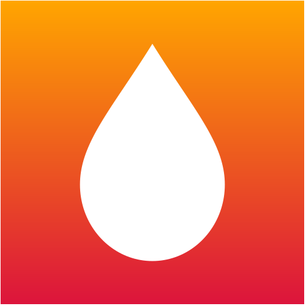

# [ CSS Monsters](https://electrolyte-orb.github.io/cssmonsters/)

---
SCSS hacks for beginners.
[View our page](https://electrolyte-orb.github.io/cssmonsters/)

## Fully Optimised Code for faster rendering

---

Clean and simple UI tutorials. Absolutely Free! 

## Languages included:
* HTML
* styling languages
    * SASS
    * CSS
* javascript

# SATISFY YOUR OWN HUNGER
> IF MY SITE IS NOT FLAWLESS TO YOU, THEN IT'S NOT!
>
> IF YOU THINK THAT ANY SITE IS FLAWLESS TO YOU THEN IT IS!

